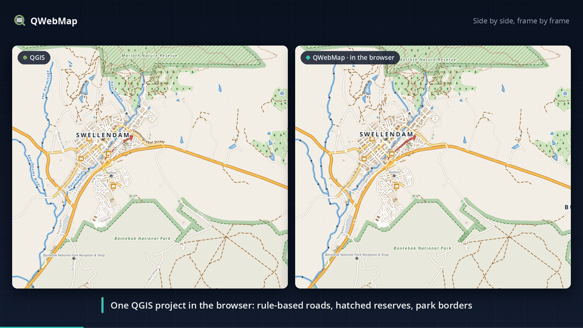
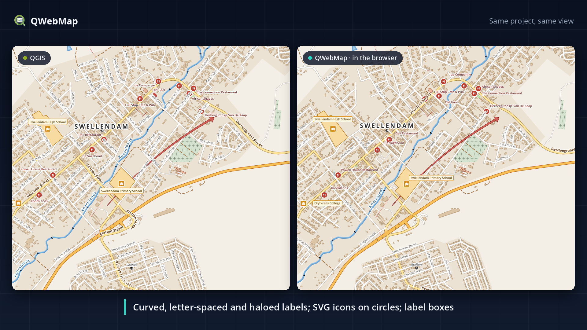
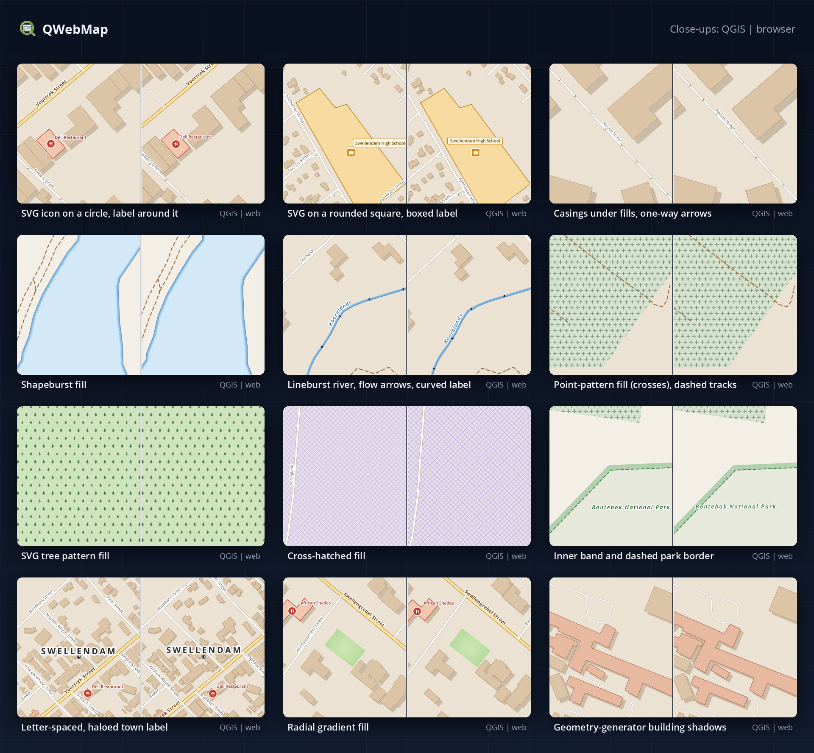
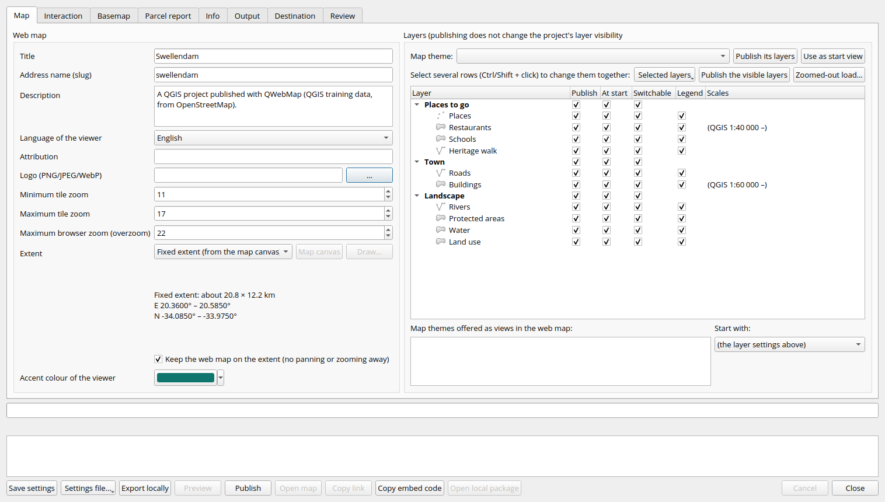
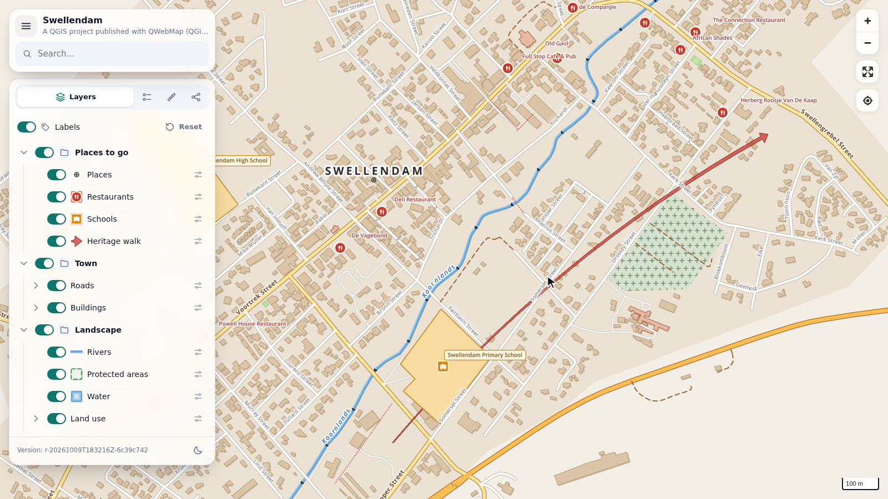
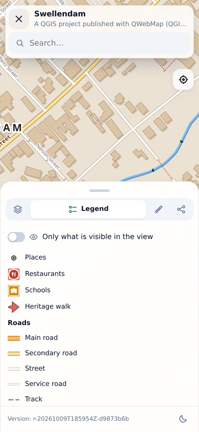
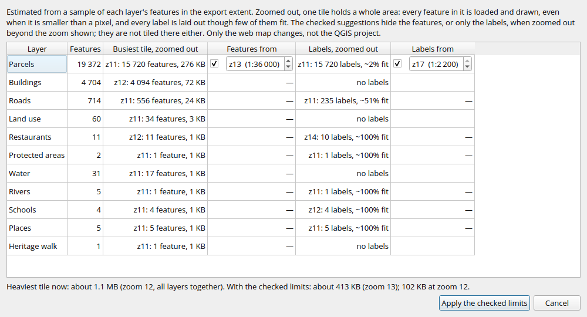

 

# QWebMap

**Publish your QGIS project to the web in one click — and it keeps its QGIS look.**

**Your QGIS symbology, converted accurately to vector tiles** · one-click publishing ·
a full web viewer · no map server, database or Docker

> **QWebMap** started as a fork of [GallPeters/QGIS2VectorTiles](https://github.com/GallPeters/QGIS2VectorTiles)
> by Jossef Kanter and grew into a complete web map publisher. Download builds from
> [Releases](https://github.com/danzig666/QGIS2VectorTiles/releases) and report issues
> [here](https://github.com/danzig666/QGIS2VectorTiles/issues). It installs as **QWebMap**
> next to the official QGIS2VectorTiles plugin.
>
> **Updating from 4.8.1 or older** (then called *QGIS2VectorTiles (fork)*): install QWebMap, then
> uninstall *QGIS2VectorTiles (fork)* in *Plugins → Manage and Install Plugins*. Settings saved
> in your projects, the window position and saved keys carry over.

<a href="docs/media/qwebmap-showcase.mp4">
<kbd>

</kbd>
</a>

<a href="docs/media/qwebmap-showcase.mp4"><b>▶ Watch the full video (MP4, 1080p)</b></a>

Demo data: Swellendam from the <a href="https://github.com/qgis/QGIS-Training-Data">QGIS training data</a> (GPL-2.0, from OpenStreetMap).

 

## What's new

This README describes QWebMap **4.31.0**. Newest first:

**4.31.0** — fidelity fixes
- **No more missing rules or blank maps:** a rule whose expression fails on one feature (for
  example text in a numeric field) is no longer dropped from the web map; like QGIS, the export
  skips just that value. Nested rule-based renderers (rules inside rules) no longer share ids,
  which stopped the whole web map from loading; a repeated style layer id is now always renamed
  and reported.
- **Drawing order and fills:** overlapping lines and polygons of different categories or rules
  keep QGIS's feature order (up to 5,000 re-ordered features and 8 levels of overlap per layer, in
  layers of up to 100,000 features; beyond that the layer keeps rule order and the fidelity report
  says so; layers with inner shadow or inner glow lines keep rule order). Polygon outline bands in millimetres are on the
  correct side and are buffered rings like QGIS's (no dark wedges at corners). Shapeburst
  distances in millimetres keep their width on screen (set per quarter zoom, within about 9 %;
  big layers get one setting per half zoom or per zoom, within about 19 % or 41 %, reported).
  Gradient fills of small features (a village green published from zoom 11) keep their outer
  colours instead of ending in one flat band. A layer's opacity (*Layer Rendering*) is converted
  (it was ignored).
- **Labels:** a feature drawn by two renderer rules (a category and a filterless outline rule) has
  one label again (it had one per rule); the viewer measures each character's own width, so Free
  labels that fit in QGIS are no longer dropped; labels with empty text no longer draw their
  background; DemiBold, Medium and Light fonts use the face QGIS draws; repeat distances in map
  units grow with the map;
  around-point labels try QGIS's positions in QGIS's order, keep clear of other labels, and small
  polygons keep theirs.
- **Markers:** hairline (zero-width) marker outlines are one pixel wide, and point-pattern dots
  are crisp.

Also in 4.31.0, in the Publish window:
- **Drawing the extent:** *Map* tab → *Extent* → **Draw…** works like QGIS's own rectangle tools:
  click one corner, then the opposite one (no need to hold the mouse button; dragging still
  works, and a click that slips a few pixels is still a click). Corners snap when QGIS snapping
  is on; the status bar says which corner comes next; right click or Esc cancels, also while
  dragging.

**4.30**
- *Map* tab → **Zoomed-out load…** estimates which layers make the web map slow when zoomed out
  and suggests a zoom from which their features, or only their labels, are drawn (on a synthetic
  city project the heaviest tile went from about 5.0 MB to about 1 MB with the suggestions).
- **Labels-only scale limit:** a layer's labels can be hidden when zoomed out while its features
  are still drawn.
- 4.30.1: the export no longer stops on labels made in older QGIS versions
  (`LabelMultiLineAlignment`); shapeburst fills with a millimetre distance now shade from the edge
  inwards instead of being one colour; labels of layers whose symbols are placed per zoom (arrows
  along rivers, one-way arrows) show at every zoom; label letter spacing is converted.

**4.29**
- The search index, the feature records and the parcel report records are one file each
  (`.pack` files read by byte ranges; a small search index is one `index.json`): a city's map is a
  few hundred files to upload instead of over 40,000 (on a city-size test, the search index and
  feature records went from 47,959 files / 45.8 MB to 2 files / 4.8 MB).
- *Map* tab → *Extent* → **Draw…**: drag the published area on the QGIS map.
- **Web → QWebMap: Publish Web Map…** is directly in the Web menu (no submenu).

**4.28**
- **Much faster export:** marker positions computed directly, helper QGIS processes, tiles cut in
  parallel and in the background. An 88-layer zoning plan (zoom 0–16, no cache, 4 cores) went
  from 6.9 min in 4.27 to 54 s, with the same tiles.
- **Fast marker lines** (optional, off by default): the browser places screen-size line markers.
  The same plan took 27 s, but the markers are not exactly where QGIS draws them.
- A network output folder keeps the work files and the cache on this computer; the export log
  names the slowest layers.
- 4.28.1–4.28.2: a switched-off data-defined setting that reads `@map_scale` no longer exports a
  layer once per zoom (city-size test: the whole publication from 8.3 to 6.1 min); the progress
  bar follows ogr2ogr's own progress; packaging checks on a city-size map went from 107 s to 32 s.

**4.27**
- Rule steps run in memory and are shared within an export: the 88-layer plan from scratch went
  from 21.5 min to 6.9 min, with the same tiles.

**4.26**
- **Full regulation texts** in the parcel report: an optional table of one simple-HTML text per
  zone code. Each zone of a clicked parcel gets a closed section that loads when opened; an
  opened section is printed with the report. Links, images, scripts and attributes are removed
  at export and again in the browser.

**4.25**
- The overview map, the 3D view and the drawing tools (new in 4.24) are optional and **off by
  default** (*Interaction → Viewer*).
- The *Review* tab names the third parties visitors' browsers contact (web basemaps, Google
  Street View); a new approval is needed when they, or a published document, change.
- Terrain problems are warnings instead of stopping the export; a missing document file or
  house-number field is reported before the export starts.

Every release: [changelog](docs/changelog.html) and
[Releases](https://github.com/danzig666/QGIS2VectorTiles/releases) (with the release notes).

## Install

QWebMap needs QGIS 3.44 or newer. Download `QWebMap-<version>.zip` from
[Releases](https://github.com/danzig666/QGIS2VectorTiles/releases) (not the `-hu` file: that is a
special Hungarian zoning-plan edition, not for general use), then *Plugins → Manage and Install
Plugins → Install from ZIP*. Install a newer ZIP the same way to upgrade.

## ⭐ Your QGIS symbology, accurately on the web

Most web map exporters keep your data and lose your styling. QWebMap converts the **QGIS
symbology itself** into vector tiles and a MapLibre style, so the web map looks like your QGIS
map: same colours, widths, patterns, icons, dashes and labels, at every zoom level. The tiles
stay vector (sharp, small and fast). Most of what cannot be drawn natively in the browser is
rendered by QGIS into sprites or pre-computed geometry; the rest is approximated or left out (see
[Fidelity report](#fidelity-report)).

 Left: QGIS. Right: the published web map (vector tiles drawn by the browser). Same project, same view.

What carries over:

- **Renderers:** single symbol, categorized, graduated and rule-based (nested rules, scale ranges,
  ELSE rules), merged features, inverted polygons, heatmap (drawn by the browser with QGIS's
  radius and colours), point cluster and point displacement (grouped with QGIS's method per
  eighth of a zoom; QGIS groups only the points in view, so some groups differ, reported); symbol
  levels and QGIS's feature order (*Control feature rendering order*).
  Overlapping lines and polygons of different categories or rules also keep QGIS's order, up to
  5,000 re-ordered features and 8 levels of overlap per layer, in layers of up to 100,000 features
  (beyond that, rule order, reported; layers with inner shadow or inner glow lines keep rule
  order). The layer's opacity (*Layer Rendering*) fades its symbols, not its labels, as in QGIS;
  QGIS blends the layer as one image, the browser each style layer, so overlaps come out a little
  darker. Point layers are drawn
  rule by rule, and a symbol with several layers (a road casing and its fill) is drawn one layer
  at a time for all features, as with symbol levels.
- **Fills:** solid fills and outlines (with their offsets), line-pattern hatches, point-pattern,
  SVG and raster pattern fills at their exact QGIS size, starting where QGIS starts them (*Align
  pattern to*); point patterns as whole markers or clipped to the shape, as set in QGIS; SVG fills
  without seams at tile edges and rotated as one texture; gradient fills (linear, radial and
  conical, two colours or a colour ramp, pad, reflect or repeat) and shapeburst fills as fine
  colour bands; centroid (point-on-surface) markers; random marker fills (approximated).
  Clipping to the shape is exact for screen-unit patterns and for simple line, cross and closed
  markers; other map-unit markers on the edge are drawn whole and rotated map-unit point patterns
  unrotated (both reported); in a rotated map-unit SVG fill each tile is turned but the grid is
  not (reported).
- **Lines:** widths, offsets (QGIS's offset line where sharp corners need it), caps, joins and
  dash patterns (including map-unit custom dashes); marker lines with markers at the QGIS
  positions (interval, vertices, centre point; data-defined intervals, and screen-unit intervals
  with *Fast marker lines* on, are placed by the browser instead); hash lines, arrows (the polygons QGIS builds), filled lines,
  lineburst, raster-image and interpolated lines, and geometry generators; outer glow and drop
  shadow on simple lines, and inner shadow and inner glow on solid simple lines with a width in
  screen units (no dashes, offset or data-defined properties).
- **Markers:** simple markers (native circles when possible), SVG markers (also data-defined
  variants), ellipse, filled and raster markers rendered by QGIS into sprites (pixel sizes kept
  on high-resolution screens); font markers as browser text in your font (static map-unit
  characters as their exact glyph outlines); vector field markers as lines.
- **Labels:** your installed fonts (glyphs are generated from them, bold, italic and weights such
  as DemiBold, Medium and Light included), buffers, background shapes, letter spacing, curved,
  parallel, Free (angled) and around-point placement, scale-based visibility, data-defined
  positions (their callouts as straight leaders to the label's anchor, reported), and an option
  to label every feature.
- **Data-defined properties:** evaluated by QGIS for each feature (`@symbol_color` included, and
  `rand()` gives every marker of a pattern fill its own value, as in QGIS); a property with no
  browser equivalent keeps its static value and is reported.
- **Units:** millimetres, points, pixels, inches, map units and metres at scale, with sizes
  computed per zoom level.

Every built-in QGIS symbol layer type is converted except the animated marker, the mask marker and
the linear referencing line; these are reported as unsupported and left out.

 Close-ups from the same project, each pair QGIS | QWebMap.

Not everything has a browser equivalent yet (for example the blur effect and other paint effects
on fills, Qt brush styles other than solid, label shadows and masks, and blend modes on vector
layers). **Every export writes a fidelity report** that lists the components that were
approximated or left out, with their layer (and rule or symbol layer when known) and usually a
suggested fix (label shadows and masks are not in it, and blend modes on vector layers only get
a warning in the Publish window), and a *Strict* mode refuses to publish when the report has an error or a warning
about an unsupported or approximated component. The generated table of each symbol layer type's
strategy and constraints is in [`docs/fidelity/CAPABILITIES.md`](docs/fidelity/CAPABILITIES.md).

## Fidelity report

Every export writes `fidelity_report.json` and `fidelity_report.html`: next to the tiles for the
Processing tool, and for *Publish Web Map* in the work folder
`<Local output folder>/.q2vt-work/<slug>/<export>/` (never uploaded). Each entry names a stable
code (`Q2VT_*`), where it happened (the layer, plus the rule or symbol layer when known), the
export strategy when one applies, and usually a suggested fix, so missing hatches or unsupported
symbols are visible without reading the log. A few differences are not in the report: label
shadows and masks, and the callouts of labels that QGIS places itself, are left out without an
entry, and blend modes on vector layers only get a warning in the Publish window.

Both the Processing tool (*Fidelity Mode*, *Beyond Maximum Zoom*) and the Publish Web Map window
(*Output* tab: *Fidelity*, *Beyond the maximum zoom*) have these settings:

- **Fidelity Mode**: *Vector-first* (default) exports what it can and reports
  approximations; *Strict* fails before anything is published if the report has an error or a
  warning about an unsupported or approximated component (information notes do not count).
- **Beyond Maximum Zoom**: keep showing the last generated tiles (overzoom) or hide all
  layers above the export's maximum zoom.

Developer documentation: [`docs/fidelity/`](docs/fidelity/) — baseline and confirmed
defects, how to run the three test levels, the generated symbol compatibility table, and
the status of each item of the fidelity plan.

## Publish Web Map

*Web → QWebMap: Publish Web Map…* (also on the Web toolbar) opens a window that turns the project
into a public, self-contained web map. The window title shows the plugin version.

 The Publish Web Map window, <i>Map</i> tab.

**Quick start**

1. *Map* tab: choose the extent and the layers (*Publish*, *At start*, *Switchable*).
2. *Interaction* tab: tick the fields that may appear in popups, search and filters.
3. *Export locally*, then *Preview* to see the web map in your browser.
4. *Destination* tab: set up Cloudflare R2 or other S3-compatible storage, or keep *Local only
   (no upload)* and copy the folder to a web server that supports Range requests.
5. *Review* tab: check what becomes public and tick the approval, then *Publish*.

### Choosing what to publish

- **Title and look** (*Map* tab): title, address name (slug), description (its first line is the
  subtitle), viewer language (English or Hungarian), attribution, logo and accent colour.
- **Zoom range** (*Map* tab): minimum and maximum tile zoom, and how far visitors can zoom in
  beyond the last tiles.
- **Published area** (*Map* tab → *Extent*): a layer's extent (follows the layer's data), the
  current map canvas (*Map canvas*), or a rectangle drawn on the QGIS map (*Draw…*: click two
  opposite corners; right click or Esc cancels). *Keep the web map on the extent* (on by
  default) stops visitors from panning away.
- **Layers** (*Map* tab): per layer or group, *Publish*, *At start* (visible when the map opens)
  and *Switchable* (untick it to make a layer or group always shown); per layer, *Legend*.
  Publishing never changes the project's own layer visibility.
- **Many layers at once:** select rows (Ctrl/Shift + click), then *Selected layers* or right-click.
  *Publish the visible layers* publishes exactly what the QGIS Layers panel shows.
- **Map themes** (*Map* tab): *Publish its layers* adds a theme's layers (several themes add up),
  *Use as start view* sets what is visible at start, and the ticked themes become one-click views
  in the web map (*Start with* picks the view it opens with).
- **Web-only scales** (*Map* tab → *Scales* column, or *Selected layers → Visible scales…*): hide a
  layer, or only its labels, beyond a scale in the web map; there it is not tiled either. Without
  one, the column shows the layer's own QGIS range, for example "(QGIS 1:2 000 –)".
- **What QGIS shows is published:** temporary (memory) layers, joined and virtual fields, and
  unsaved edits.
- **Public fields** (*Interaction* tab, per layer): which fields appear in popups (with titles
  and types), are searchable, become filters or identify a feature for links. Only ticked fields
  become public.
- **Per-layer viewer settings** (*Interaction* tab): title in the viewer, feature title (an
  expression), initial opacity, feature links, *Label every feature* (a label that does not fit
  is drawn smaller instead of dropped), *Measurements snap to this layer*, and a *3D height field
  (m)* that raises polygons such as buildings in the 3D view (the heights become public).
- **Address search** (*Interaction* tab): *Search street names (OpenStreetMap)*, and a *House
  numbers* layer so visitors can search "Fő utca 12" (the street from a field, or the nearest
  OpenStreetMap street).
- **Raster layers** (orthophotos, scanned plans, rendered DEMs) are drawn by QGIS into their own
  image tiles; vector layers always stay vector tiles. Select one on the *Interaction* tab:
  *Image format* (WebP by default, falling back to PNG if QGIS cannot write WebP; PNG or JPEG),
  *Sharpest detail* (like the image, like the map, or a pixel size in metres, with an estimate),
  *Shown from zoom*, quality and opacity.
- **OpenStreetMap vector basemap** (*Basemap* tab, Protomaps): copied into the release in the
  styles you tick (light, dark, white, grayscale, black), from the latest Protomaps daily build
  (internet needed while exporting) or a PMTiles file, with its most detailed zoom, the area
  around the extent and overview zooms; you choose the basemap shown at start, and visitors switch
  it or turn it off.
- **Web basemaps** (*Basemap* tab): your QGIS XYZ tile connections, new ones (*Add new…*) and WMS
  services (*Add WMS…*, for example official orthophotos) with https:// addresses (web pages
  cannot load http:// tiles) in the viewer's basemap menu. Visitors' browsers load them from their
  server; nothing is copied.
- **Terrain** (*Basemap* tab): an elevation layer (DEM) gives an optional hillshade, elevation
  profiles of measured lines (with *Measurement* on) and the relief of the 3D view (with *3D view*
  on; both are off by default on *Interaction → Viewer*), with a height exaggeration for 3D.
- **About the map** (*Info* tab): *Issued by*, *Decree / plan number*, *In force from* and *Data
  as of*. The dates show under the map title; everything shows in the viewer's *About this map
  and documents* block and on prints.
- **Documents** (*Info* tab → *Add document…*): PDF, Word/ODT, RTF, text and image files are
  copied into the web map and listed in its panel; a popup value naming a document links to it.
- **Parcel report** (*Parcel report* tab; optional, made for zoning plans): clicking a parcel
  shows its area, its parts cut by the zoning and the regulation lines, its zones and every
  restriction touching it, with legend graphics (computed in QGIS from the exact geometry when
  exporting). Optional zone regulation table and full regulation texts. It prints zoomed on the
  parcel.

### Publishing and hosting

- **Export locally** builds the release on this computer. **Preview** (after an export) serves it
  on `127.0.0.1` with byte ranges and opens your browser. Neither needs an account or an upload.
  They work offline unless the export reads OpenStreetMap data from the Protomaps build (the
  basemap, or, without a basemap, street-name search and house-number search without a street
  field), a published raster layer is
  an online service, or the map uses web basemaps or Street View.
- **Output** tab: PMTiles, or PMTiles plus an MBTiles copy next to the publication folder (the web
  map itself always uses PMTiles; *MBTiles only* cannot be uploaded), the local output folder, an optional offline ZIP of the release and the legacy XYZ web package.
  *Polygon labels* places polygon labels on the whole polygon, on its part visible on screen, or
  as set in each layer.
- **Publish** uploads an immutable release to **Cloudflare R2** or other S3-compatible storage
  that supports conditional writes (*Destination* tab), checks it through your public address,
  and only then switches the stable link, so the previous map stays online if anything fails.
  Unchanged files are copied inside the bucket instead of uploaded again.
- **Stable address:** it always opens the current release; each release also has its own
  address, so old links keep working until you delete that release.
- **Destination tab:** *Step-by-step: set up Cloudflare R2…* shows where each value is in the
  Cloudflare dashboard; *Test connection* checks the storage; *Show CORS policy* gives a policy to
  paste when the viewer runs on another address.
- **Rollback** (*Destination → Releases and rollback…*): make an earlier release current again,
  delete old releases or abort interrupted uploads; *Releases to keep* sets how many releases
  *Delete old releases…* keeps (nothing is deleted automatically).
- **Sharing:** *Open map*, *Copy link* and **Copy embed code**, a ready `<iframe>` for another web
  page. The embedded map is compact, has an *Open the full map* link, zooms with the scroll wheel
  only while Ctrl/⌘ is held, and on touch screens moves only with two fingers, so page scrolling
  is not captured.
- **Any static web server** works: choose *Local only (no upload)* and copy the publication folder.
  The map data is one **PMTiles** archive (raster layers, terrain and the basemap in their own
  archives; the search index, feature records and parcel report records in one file each), read
  with HTTP byte ranges, so no tile server, database or Docker is needed. **The web server must
  support HTTP Range requests** (`206 Partial Content`): Cloudflare R2, S3, nginx and Apache do;
  `python -m http.server` does not (the map then shows `Q2VT_PUB_RANGE_UNSUPPORTED`). Opening
  `index.html` as a `file://` page does not work at all: browsers block the viewer's modules
  there, so the page stays on "Loading…"; use *Preview*. Do not gzip `.pmtiles` and `.pack`
  files, and serve `.mjs` as `text/javascript`. See [HOSTING.md](docs/publishing/HOSTING.md).
- **Only the fields you approve are published as fields**; what the map draws is public too
  (geometry, label texts and other values the style computes from fields, approved or not). Every
  tile is checked before upload. *Output →
  Publish ALL attribute fields in the tiles* is an opt-in (not recommended), and the *Review* tab
  warns about it.
- **Review tab:** lists the target address, each published layer and its public fields, the
  basemap, terrain, documents, parcel report data, the third parties visitors' browsers contact
  (web basemaps, Google Street View) and the viewer extras that are on. The first publication, and
  any change to what becomes public, needs your approval.
- **Problems are found early:** repeated or missing feature keys, missing parcel report layers or
  fields, missing document files and house-number fields are reported in the first seconds of an
  export, with where to fix them.
- **Settings** are saved in the project (*Save settings*, then save the project file). Object
  storage keys are not: they stay encrypted in the QGIS authentication database (*Save keys in
  QGIS…*) or are typed for this session only. *Settings file…* exports the settings to a file
  (with the storage keys, secret included, when the destination has them: keep it private) and
  imports them into another project, matching layers by name. The Google Street View key is a
  project setting and is visible in the published page, so restrict it in Google Cloud.
- When the settings come from another project file, the window asks whether to keep updating the
  same web map or start a new one. *Preset…* fills the settings from domain conventions (only in
  editions that ship presets).

### The web viewer

 The web viewer on a desktop and on a phone.

On by default (each can be switched off on *Interaction → Viewer*):

- **Layers** tab: QGIS groups, layers and their legend rules with QGIS swatches, a lock on layers
  that are always shown, opacity sliders, one switch for all labels (without it, labels are always
  on), and *Reset*. Without it, visitors get the legend, with an on/off switch for each layer.
- **Search** in the approved fields of all layers; the chosen feature is zoomed to and marked,
  and its popup opened when popups are on.
- **Filters** by value lists (with counts), number ranges or text.
- **Popups** with the approved fields; a value naming a published document links to it; *Link to
  this feature* copies a link that reopens the map on that feature.
- **Share** tab: *Link to the current map (follows updates)* or *Link to this exact version*.
  Links keep the view, layers, labels, opacity, filters, basemap, selected feature and drawing.
- **Coordinates** of the pointer in WGS 84 and in the project's coordinate system (*Tools* tab).
- **Print** (*Tools* tab): a map extract of the current view at a chosen scale on A4 or A3,
  landscape or portrait, with a north arrow, a scale bar, the legend, and a header with the
  issuer, decree, dates, scale and print date.

Always there:

- **Legend** with symbols rendered by QGIS (and your legend patch shapes); *Only what is visible
  in the view* lists only what is drawn (*Interaction → Viewer* sets whether it starts on).
- **Views** bar with the QGIS map themes you offered (hidden when there is only one).
- Zoom, full screen, my location (on HTTPS pages) and a scale bar; a **Basemap** menu (with a
  preview of each OpenStreetMap style) when the map has a basemap or web basemaps.
- **About this map and documents** at the bottom of the panel (a folded block, shown when the
  *Info* tab has data): issuer, decree, dates and the documents.
- **Desktop and phone:** a floating panel with tabs on desktop, a bottom sheet on phones; light
  and dark appearance (follows the system until the visitor chooses); your accent colour and logo.
- The visitor's layer, label, opacity, filter and basemap choices are remembered in their
  browser. A shared link shows the published map with the sender's changes instead, also when it
  is pasted into a tab where the map is already open.
- When the map cannot be shown (no WebGL, no Range support, a missing or damaged map file …), the
  viewer says why in plain words, with the technical detail. A basemap, terrain or symbol that
  fails to load gives a warning while the map still works.
- The viewer language (English or Hungarian) is set per map on the *Map* tab.

Off by default (turn them on on *Interaction → Viewer*):

- **Measurement** (*Tools* tab): distances and areas, snapping to the corners or edges of the
  layers you chose (hold Alt for a free point). With terrain, a measured line gives an
  **elevation profile** (lowest and highest point, climb and descent).
- **Search street names (OpenStreetMap)** inside the map's area.
- **Overview map (inset)**: a small map in the corner with the current view; it can be folded
  away.
- **3D view**: tilts the map, raises polygons with a *3D height field* and shows the terrain
  relief.
- **Drawing tools** (*Tools* tab): points, lines, areas and text in a few colours. The drawing
  travels in the shared link (nothing is stored on the site) and can be saved as GeoJSON or KML.
- **Street View (Google)** (needs your Google API key): a button under the zoom buttons shows blue
  lines where Street View exists; a tap opens the nearest panorama looking toward the tapped
  spot, with a draggable viewpoint on the map. Works on phones. If the key lacks the Map Tiles
  API, the viewer says why the blue lines are missing.

### Speed

- **Reuse unchanged layers** (*Output → Reuse unchanged layers from earlier exports*, on by
  default; *Clear cache…*): layers whose data, style and settings did not change, raster layers
  included, are not processed again; the export log says why each other layer was redone.
  Database and web layers are always exported. (4.5: a re-export of a 40-layer zoning plan went
  from about 170 s to 15 s.)
- **Parallel export:** big exports use helper QGIS processes, cut tiles in parallel and in the
  background, and draw raster tiles on several cores, up to *Output → CPU limit (%)*. (4.28: an
  88-layer zoning plan from scratch in 54 s on 4 cores.)
- **Fast marker lines** (*Output*, off by default): the browser places marker lines spaced in
  screen units instead of the export computing them for every zoom. Much faster, but the markers
  are not exactly where QGIS draws them (the fidelity report says so).
- **Network output folders** (a Windows share or mapped drive): the work files and the cache stay
  on this computer; only the finished map, the export log and the fidelity report go to the
  network folder.
- **Progress and log:** every export step has its share of the progress bar, which follows
  ogr2ogr's own progress while tiles are cut; the export log names the slowest layers, which is
  where to look first when an export is slow.

### Tools for big maps

 The <i>Zoomed-out load</i> window (4.30).

- **Zoomed-out load** (*Map* tab → *Zoomed-out load…*): estimates which layers make the web map
  slow when zoomed out and each layer's share of the heaviest tile, and suggests per layer a zoom
  from which its features, or only its labels, are drawn. *Apply the checked limits* puts them
  into the *Scales* column. Only the web map changes, not the QGIS project.
- **Labels-only scale limit** (*Selected layers → Visible scales… → Hide only the labels when
  zoomed out beyond*): a layer's labels are hidden when zoomed out while its features are still
  drawn; the *Scales* column shows it as "labels 1:10 000 –". Hidden labels are not tiled, so the
  export is smaller.
- **A few hundred files:** the search index, feature records and parcel report records are one
  file each, so even a city's map uploads quickly.
- **Tip:** a layer drawn at every scale, such as every parcel of a city, is in the zoomed-out
  tiles too, where one tile holds all of it. A scale range in QGIS, or a web-only one in the
  *Scales* column, makes the export faster and the web map lighter.

## Processing tool

*Processing Toolbox → QWebMap → Export vector tile package* still exports a static vector tile
package: MBTiles by default (PMTiles or both with *Tile archive format*), a MapLibre style, a
viewer and the fidelity report. Its options include *Fidelity Mode*, *Beyond Maximum Zoom* and a
static XYZ web package. Big exports use the helper QGIS processes on their own; the *Parallel
export* option is an older thread mode, off by default, that can crash QGIS.

## Documentation

Documentation: [`docs/publishing/`](docs/publishing/), covering
[hosting and R2 setup](docs/publishing/HOSTING.md),
[security](docs/publishing/SECURITY.md),
[architecture](docs/publishing/ARCHITECTURE.md),
[tests](docs/publishing/TESTING.md) and
[implementation status](docs/publishing/IMPLEMENTATION_STATUS.md);
[`docs/fidelity/`](docs/fidelity/) for the symbology conversion;
[changelog](docs/changelog.html) and [release notes](releases/).
