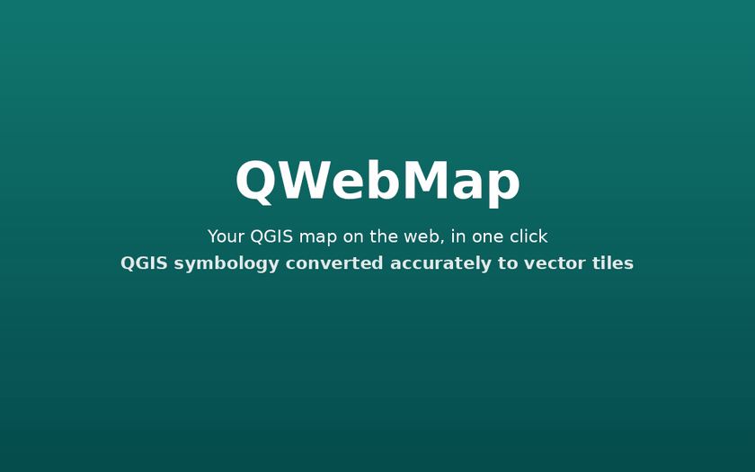
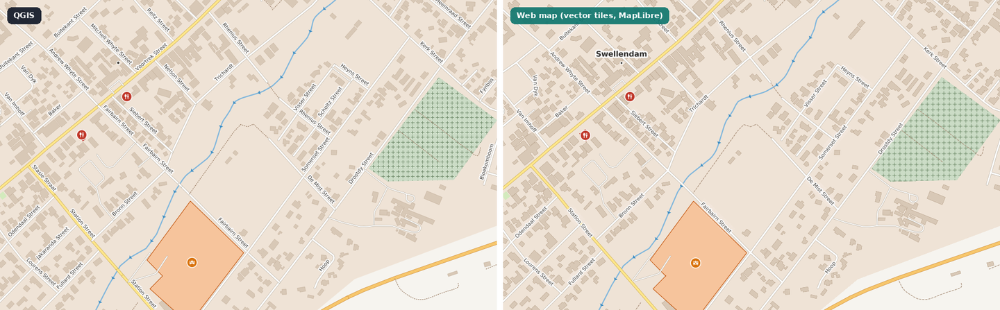

 

# QWebMap

**Publish your QGIS project to the web in one click — and it keeps its QGIS look.**

**Your QGIS symbology, converted accurately to vector tiles** · one-click publishing ·
a full web viewer · no map server, database or Docker

> **QWebMap** started as a fork of [GallPeters/QGIS2VectorTiles](https://github.com/GallPeters/QGIS2VectorTiles)
> by Jossef Kanter and grew into a complete web map publisher. Download builds from
> [Releases](https://github.com/danzig666/QGIS2VectorTiles/releases) and report issues
> [here](https://github.com/danzig666/QGIS2VectorTiles/issues). It installs as **QWebMap**
> next to the official QGIS2VectorTiles plugin.
>
> **Updating from 4.8.1 or older** (then called *QGIS2VectorTiles (fork)*): install QWebMap, then
> uninstall *QGIS2VectorTiles (fork)* in *Plugins → Manage and Install Plugins*. Settings saved
> in your projects, the window position and saved keys carry over.

<kbd>

</kbd>

Demo data: Swellendam from the <a href="https://github.com/qgis/QGIS-Training-Data">QGIS training data</a> (GPL-2.0, from OpenStreetMap).

 

## ⭐ Your QGIS symbology, accurately on the web

Most web map exporters keep your data and lose your styling. QWebMap converts the **QGIS
symbology itself** into vector tiles and a MapLibre style, so the web map looks like your QGIS
map: same colours, widths, patterns, icons, dashes and labels, at every zoom level. The tiles
stay vector (sharp, small and fast), and anything that cannot be drawn natively in the browser is
rendered by QGIS into sprites or pre-computed geometry instead of being dropped.

 Left: QGIS. Right: the published web map (vector tiles in the browser). Same project, same view.

What carries over:

- **Renderers:** single symbol, categorized, graduated and rule-based (nested rules, scale ranges,
  ELSE rules), symbol levels and the QGIS drawing order.
- **Fills:** solid fills and outlines, line-pattern hatches, point-pattern, SVG and raster pattern
  fills, gradient fills (linear, radial and conical, two colours or a colour ramp) and shapeburst
  fills as fine colour bands, centroid (point-on-surface) markers, random marker fills
  (approximated).
- **Lines:** widths, offsets, caps, joins and dash patterns (including map-unit custom dashes);
  marker lines with markers at the QGIS positions (interval, vertices, centre point); hash lines,
  arrows, filled lines and geometry generators; outer glow and drop shadow effects on lines.
- **Markers:** simple markers (native circles when possible), SVG markers (also data-defined
  variants), font markers, ellipse, filled and raster markers, rendered by QGIS into sprites.
- **Labels:** your installed fonts (glyphs are generated from them, bold and italic included),
  buffers, curved, parallel and around-point placement, scale-based visibility, data-defined
  positions and callouts, and an option to label every feature.
- **Units:** millimetres, points, pixels and map units, with sizes computed per zoom level.

Not everything has a browser equivalent yet (for example interpolated lines, inner shadow and
blur effects). **Every export writes a fidelity report** that lists, layer by layer, what was
exact, approximated or unsupported, with a suggested fix, and a *Strict* mode refuses to publish
anything that would not match. The full, generated table is in
[`docs/fidelity/CAPABILITIES.md`](docs/fidelity/CAPABILITIES.md).

## Fidelity report

Every export writes `fidelity_report.json` and `fidelity_report.html` next to the
tiles. Each entry names a stable code (`Q2VT_*`), the layer/rule/symbol layer, the export
strategy used and a suggested fix, so missing hatches or unsupported symbols are visible
without reading the log.

The Processing dialog has two new options:

- **Fidelity Mode**: *Vector-first* (default) exports what it can and reports
  approximations; *Strict* fails before anything is published if any component is
  unsupported or approximated.
- **Beyond Maximum Zoom**: keep showing the last generated tiles (overzoom) or hide all
  layers above the export's maximum zoom.

Developer documentation: [`docs/fidelity/`](docs/fidelity/) — baseline and confirmed
defects, how to run the three test levels, the generated symbol compatibility table, and
the status of each item of the fidelity plan.

## Publish Web Map

*Web → QWebMap → Publish Web Map…* (also on the Web toolbar) opens a
window that turns the project into a public, self-contained web map:

- The map stays **vector tiles** (MVT). They are packed into one **PMTiles** archive that
  the browser reads with HTTP byte ranges, so you need no tile server, database or Docker.
- The viewer has a layer tree (including hidden layers you chose to publish), opacity,
  legend with QGIS-rendered symbols (and your legend patch shapes), label switch, filters, popups, search, links to
  features, permalinks, measuring, coordinates in the project's CRS and a phone layout. It is
  available in Hungarian and English.
- Every setting is **saved in the project**, but credentials are not. Keys stay in the
  QGIS authentication database.
- *Export locally* and *Preview* work offline. *Publish* uploads an immutable release to
  **Cloudflare R2** (or other S3-compatible storage; a step-by-step R2 guide is built into the
  window) and checks it through your public domain. Only then does it switch the stable link, so the previous map stays online if
  anything fails. *History* rolls back to an earlier release or removes old ones.
- Only the fields you approve become public; every tile is checked before upload.
- **Raster layers** (orthophotos, scanned plans, rendered DEMs) are drawn by QGIS into their own
  image tile archive (PNG, WebP or JPEG); vector layers always stay vector tiles.
- An optional **OpenStreetMap vector basemap** (Protomaps) is bundled into the release in
  several styles (light, dark, grayscale…); visitors switch it or turn it off.
- **QGIS map themes** can select the published layers (adding up: publish the layers of
  several themes one after the other) and become one-click views in the web map; layers and groups can be marked as *always shown*; many rows can be changed at once.
- **Parcel report**: clicking a parcel shows its area, its parts cut by the zoning and the
  regulation lines, its zones and every restriction touching it, with legend graphics
  (computed in QGIS from the exact geometry when exporting); printed zoomed on the parcel.
- A modern viewer: floating panels on desktop, a bottom sheet on phones, light and dark
  appearance, your accent colour.
- **Fast re-exports**: unchanged layers (raster layers too) are reused from earlier exports,
  raster tiles are rendered on all CPU cores, and unchanged files are copied inside the bucket
  instead of uploaded again (a 3-minute plan re-exports in ~15 s).

The Processing algorithm is unchanged; it gained an optional *Tile archive format*
(MBTiles, PMTiles or both).

Documentation: [`docs/publishing/`](docs/publishing/), covering
[hosting and R2 setup](docs/publishing/HOSTING.md),
[security](docs/publishing/SECURITY.md),
[architecture](docs/publishing/ARCHITECTURE.md),
[tests](docs/publishing/TESTING.md) and
[implementation status](docs/publishing/IMPLEMENTATION_STATUS.md).
